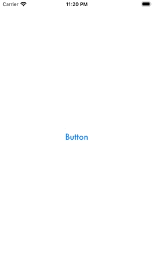

<p align="center">

</p>

# SpinnerButton

[](https://travis-ci.org/maxkalik/SpinnerButton)
[](https://cocoapods.org/pods/SpinnerButton)
[](https://cocoapods.org/pods/SpinnerButton)
[](https://cocoapods.org/pods/SpinnerButton)

## Example



To run the example project, clone the repo, and run `pod install` from the Example directory first.

## Requirements

## Installation

SpinnerButton is available through [CocoaPods](https://cocoapods.org). To install
it, simply add the following line to your Podfile:

```ruby
pod 'SpinnerButton'
```

## Author

maxkalik, maxkalik@gmail.com

## License

SpinnerButton is available under the MIT license. See the LICENSE file for more info.
